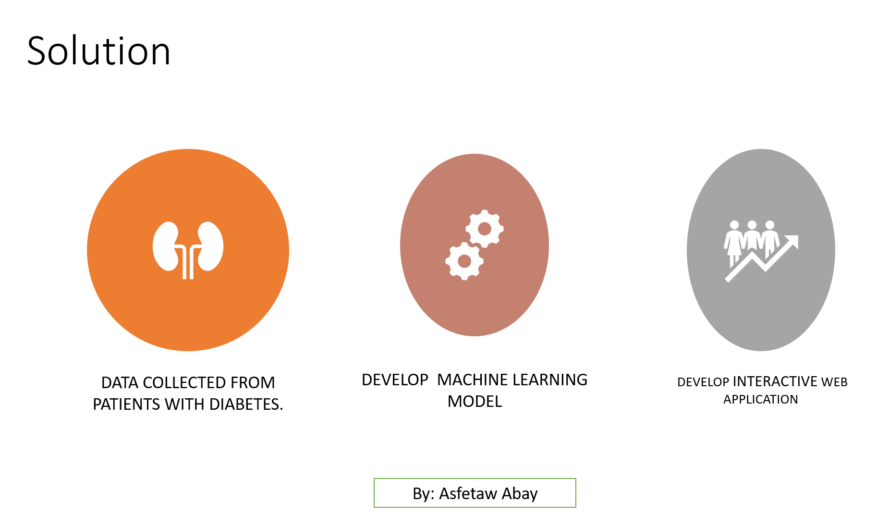

Predicting the progression of diabetes

# objective:

Develop a machine learning application  integrating with interactive web  application that
* Individuals 
* Health cares 
* Health insurance 

 helps to identify the progression of diabetes on specific person 




# Repository

This repository contains the following files and directories 

* app.py: 
* Templates --
            |-index
            |-capstoneproject
            |-visualization
            |-contact
            
* static ---
           |--image--
                   |--Explorative images 
           |--asset
* env
* Procfile
* requirements 


##  Data Collection 

### CapstoneFinalFile.ipynb

This main all the source codes to handle the main steps of the the project.
* importing the orginal source data (url="https://www4.stat.ncsu.edu/~boos/var.select/diabetes.tab.txt") using the pandas Dataframe.
* Data preprocessing and wrangling :
    * Prepare the dataset  for training and 
    * cleane observations by removing  duplicates, correct errors, deal with missing values, normalization, data type conversions
* Explorative alaysis 
    * Visualize data to help detect relevant relationships between the risk factors (independent variables) such as Age , Sex, Body mass index and siz blood test result(serum) and the the glood suger amount(dependent variable)
    * generate the explorative results such as histogram  , box-blot , statstical description , and tabulated the relationship between the independent dependent variables.
* Pipline and transformors:
    *  The pipline has a class that  transformers the categorical varaible (SEX) using One Hot Encoder and feature scaling (normalize) to ensure all  independent variables are centered around 0  using StandardScaler which is provided by sklearn 
* Train the machine learning model:
    * As a supervised learning this has a split the dataser into training and test by using the train_test_split class of sklearn and fitted using regressosors (LinearRegression , RandomForest,KNeighborsRegressor,Ridge, RidgeCV).The training process continues until the model achieves a desired level of accuracy on the training data and the best regeressor.

* Optimal value of a model:
      * GridSearchCV is used to perform hyper parameter tuning in order to determine the optimal values for a given model.
      * To test generalizability and  of the model i was using cross_validate class that provided by sklearn
      * plotting scores cross_value_score, training  and test error using matplotlib library provided by sklearn
 * Model Evaluation and selection:
      *i have  are going to tune and train 5 models using (LinearRegression , RandomForest,KNeighborsRegressor,Ridge, RidgeCV) to investigate the highest performing models among them.i added  few additional lines of code to evaluate the tuned regressor  performance on a test and and training dataset on different data size(10%, 20%,30%,40% and 50%) and  save the result.
* Finalize the model with serialization:
    * dill  librarly was used to  serializing objects  the selected model(KNNRegressor).
    *i used this operation to serialize the machine learning algorithms and save the serialized format (dill file).
    * finally i loded this file on app.py  to deserialize the model and to make new predictions that comes from HTML file (user form)

## app.py file

* This is core part of the entire application that connect user and the machine learning model by having function 
    * Creating an instance of flask object 
    * Loading the serialized model 
    * Predicting and return the result through the HTML templates 
    * System Exception handling 
    * implement setup routs for each backend endpoint by allowing HTTP methods (POST and GET)
  

## templates

This directory consists of HTML files to implement the view functions .
i leverage the jinja template inhereitance sothat 
* base.html : contains a base template that consists of all HTLM doc structure and blocks are defined to be reused by other HTLM files 
* capstoneprojct.html : the main user form and result section is deigned in this template 
* visualize.html : This template contains the explorative result of the machine learining and table of the performance of each model at different size of both on training and test stage
* contact.html : contains the contact information of the developer.


## static

This director consists of 
    * Images that are plotted by the project be sent to the browser when requested
    * the serialized part of the selected machine learning model will be loaded at app.py file when prediction is required.

## Procfile 

* This file is created to  fullfile the requirement of Heroku app deployment
* Contain a defined command that declare the process type (
          web: gunicorn app:app

## requirement.txt

 * This file  contains a pinned version of everything that are used in this package 
            click==7.1.2
            dill==0.3.1.1
            Flask==1.1.2
            gunicorn==20.0.4
            itsdangerous==1.1.0
            Jinja2==2.11.2
            joblib==0.15.1
            MarkupSafe==1.1.1
            numpy==1.18.4
            pandas==1.0.3
            python-dateutil==2.8.1
            pytz==2020.1
            scikit-learn==0.23.1
            scipy==1.4.1
            six==1.15.0
            sklearn==0.0
            threadpoolctl==2.0.0
            Werkzeug==1.0.1
 * it is  used to force pip to install version of a sub-dependency

## env

This directory contain a separate enviroment of this project. 

env--
            | <br>
            |---Lib <br>
                 |-----site-package<br>
            |---Scripts<br>
            |---pyvenv

* Lib : that interactive with the virtual enviroment cotain a copy of python version where each dependency is installed
* Scripts:are used to set up shell to use the environment’s Python executable and its site-packages by default.to activate the env the followed command shoud executed at the shel
                     $ source env/Scripts/activate


```python

```
